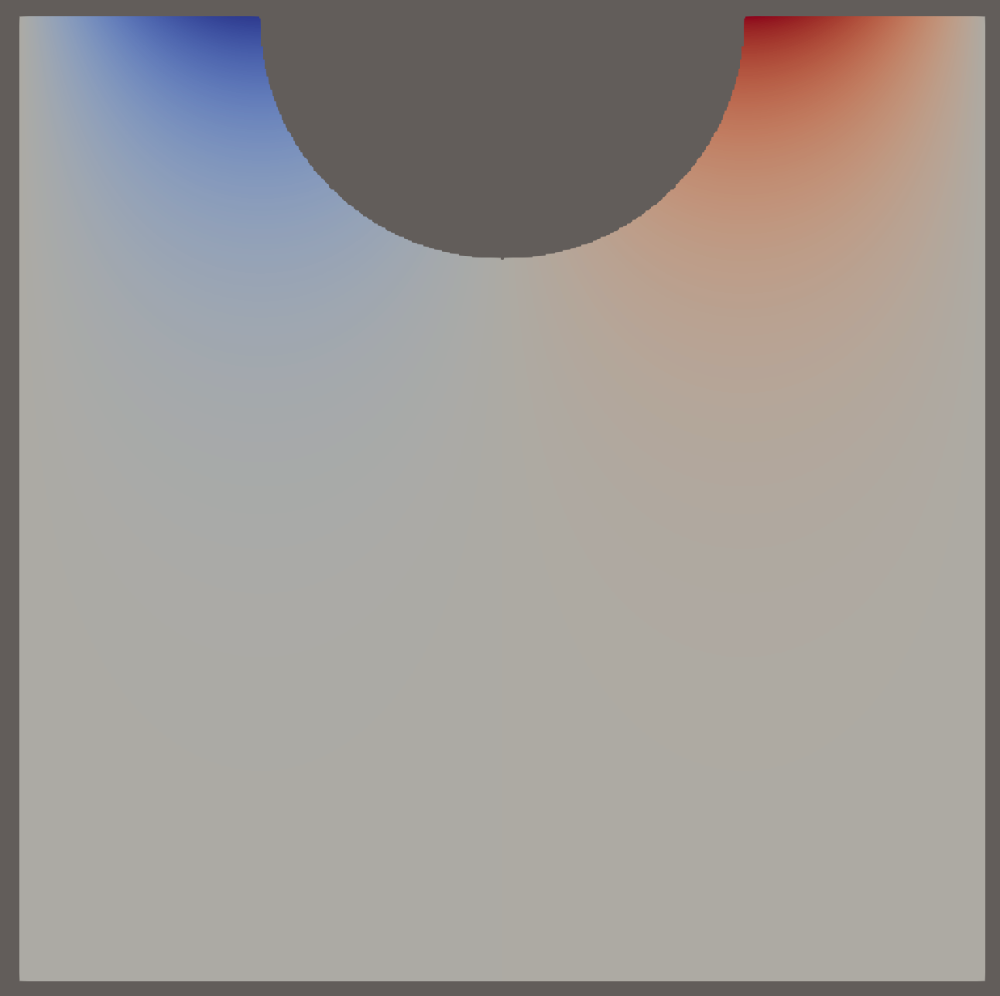
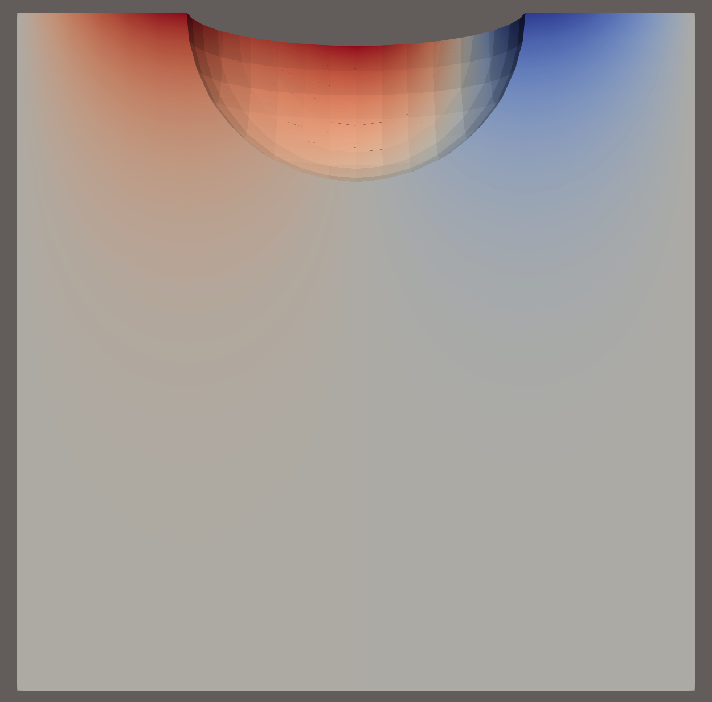
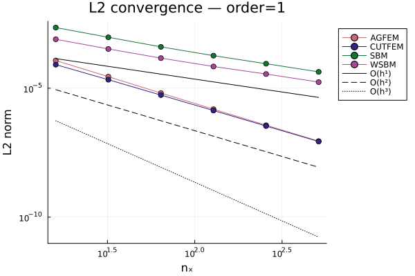
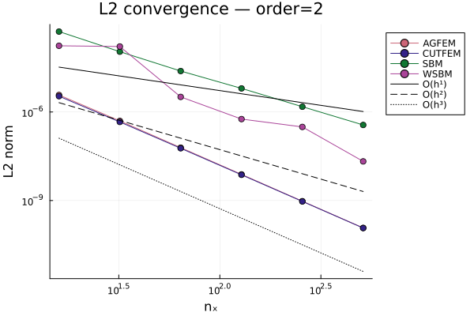
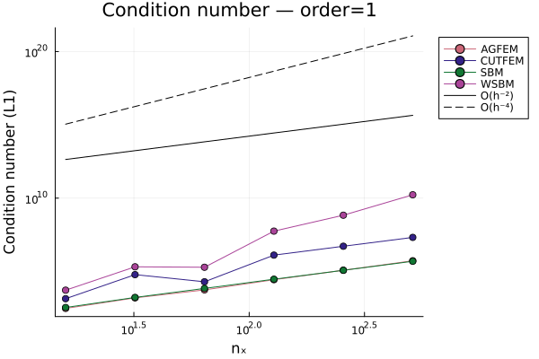
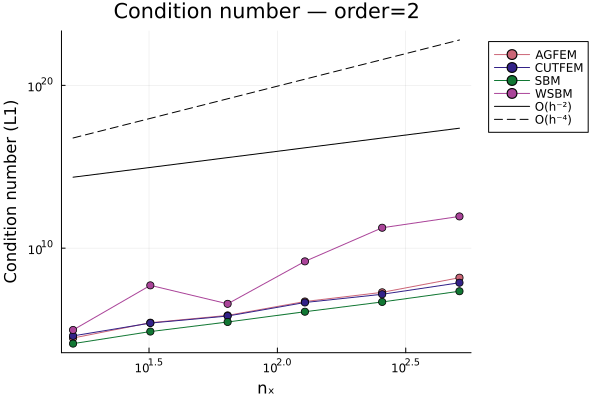
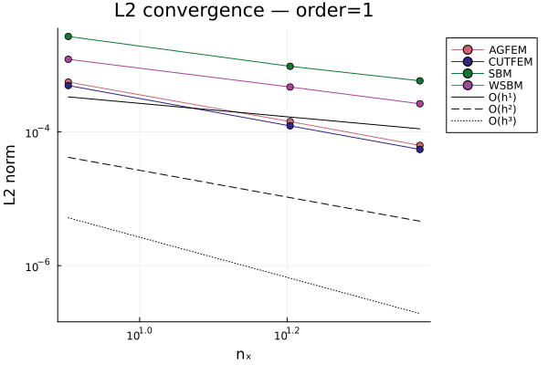
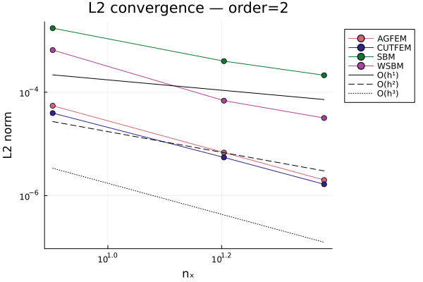
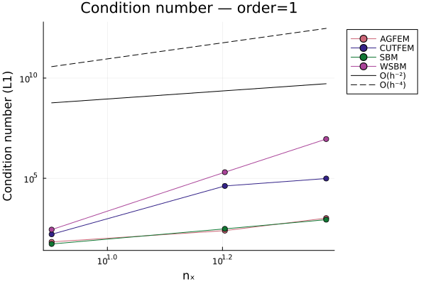
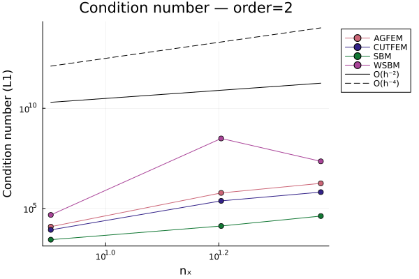

# EmbeddedBenchmark.jl

Comparative benchmark study for several embedded / immersed / unfitted Finite Element methods, namely: CutFEM [1], AgFEM [2], SBM [3] and WSBM [4]. The goal of this study is to compare the aforementioned methods within a single numerical framework built on top of [Gridap.jl](https://github.com/gridap/Gridap.jl) and [GridapEmbedded.jl](https://github.com/gridap/GridapEmbedded.jl).

A comparison is made on:
- **Accuracy** — L2 error norms and convergence rates for polynomial orders 1 and 2
- **Condition numbers** — L1 condition number of the system matrix
- **Performance** — minimal compute time and memory allocations per pipeline stage

Results are reported in both 2D and 3D, with implicit (level-set) geometrical representation of the embedded boundary. STL-based explicit geometry support is implemented but not yet available and tested within the updated package.

---

## Methods

| Method | Reference | Geometry | Ghost penalty |
|--------|-----------|----------|---------------|
| AgFEM  | [2]       | Level-set / STL | Cell aggregation |
| CutFEM | [1]       | Level-set / STL | Ghost penalty on skeleton |
| SBM    | [3]       | Level-set / STL | — |
| WSBM   | [4]       | Level-set / STL | Weighted ghost penalty on skeleton |

---

## Test problem

The benchmark solves a Laplace problem with Neumann boundary conditions using the Method of Manufactured Solutions (MMS). The manufactured solution is the Airy wave velocity potential:

**2D:**
$$\phi(x_1, x_2, t) = \frac{\eta_0 g}{\omega} \frac{\cosh(k(x_2+d))}{\cosh(kd)} \sin(kx_1 - \omega t)$$

**3D** (diagonal propagation):
$$\phi(x_1, x_2, x_3, t) = \frac{\eta_0 g}{\omega} \frac{\cosh(k(x_3+d))}{\cosh(kd)} \sin\!\left(kx_1 + kx_2 - \omega t\right)$$

where the dispersion relation $\omega = \sqrt{gk\tanh(kd)}$ is enforced. The source term $f = -\Delta\phi$ is nonzero in 3D and assembled into the right-hand side.

---

## Domains and geometries

**2D — Cylinder (circle cross-section):**


*Figure 1: 2D computational domain with embedded cylinder. The fluid domain Ω⁻ is the region outside the cylinder. The surrogate boundary Γ₁ consists of cut cell faces. The free surface Γ₂ is the top boundary.*

**3D — Sphere:**


*Figure 2: 3D computational domain with embedded sphere.*

---

## Convergence results

### 2D — Cylinder

**L2 convergence:**


*Figure 3: L2 convergence for all four methods, polynomial order 1, 2D cylinder.*


*Figure 4: L2 convergence for all four methods, polynomial order 2, 2D cylinder.*

**Condition numbers:**


*Figure 5: Condition number (L1 norm) for all four methods, polynomial order 1, 2D cylinder.*


*Figure 6: Condition number (L1 norm) for all four methods, polynomial order 2, 2D cylinder.*

### 3D — Sphere

**L2 convergence:**


*Figure 7: L2 convergence for all four methods, polynomial order 1, 3D sphere.*


*Figure 8: L2 convergence for all four methods, polynomial order 2, 3D sphere.*

**Condition numbers:**


*Figure 9: Condition number (L1 norm) for all four methods, polynomial order 1, 3D sphere.*


*Figure 10: Condition number (L1 norm) for all four methods, polynomial order 2, 3D sphere.*

---

## Performance results (2D, cylinder)

Performance is measured by running each pipeline stage `n_runs` times after `n_warmup` warmup runs. The minimum time and minimum allocation count are reported to reduce the effect of system noise. GC is disabled during timed runs.

The pipeline stages are:

| Category | Description |
|----------|-------------|
| `:setup` | Model construction, cutting, quadratures, weak form, RHS |
| `:domain` | Domain and triangulation construction |
| `:spaces` | FE space construction |
| `:interior_matrix` | Assembly of interior bilinear form |
| `:ghost_matrix` | Assembly of ghost penalty matrix (CutFEM, WSBM) |
| `:boundary_matrix` | Assembly of shifted boundary matrix (SBM, WSBM) |
| `:solving` | Linear solve |

**Time breakdown — order 1:**


*Figure 11: Normalised time breakdown per pipeline stage, polynomial order 1, 2D cylinder. Each bar corresponds to one mesh size nₓ.*

**Time breakdown — order 2:**


*Figure 12: Normalised time breakdown per pipeline stage, polynomial order 2, 2D cylinder.*

---

## Package structure

```
src/
    EmbeddedBenchmark.jl     # main module
    Parameters.jl            # parameter structs
    ManufacturedSolutions.jl # AirySolution + manufactured_functions
    SolutionConstructor.jl   # solution construction helpers
    DomainConstructor.jl     # Domain, Measures, volume_fraction
    EmbeddedGeometry.jl      # CylinderGeometry, SphereGeometry, distances
    FESpaces.jl              # FESpaceConfig, FESpaces, build_spaces
    WeakForms.jl             # WeakForm, build_weak_form
    BenchmarkRunner.jl       # benchmark, convergence_run, single_run
    Plotting.jl              # save/load JSON, plotting functions
scripts/
    TimeBenchmark.jl         # performance benchmark entry point
    Convergence.jl           # convergence study entry point
test/
    runtests.jl              # unit tests
data/                        # saved JSON results
```

---

## Usage

### Convergence study

```julia
import Pkg; Pkg.activate(".")
using EmbeddedBenchmark

params = SimulationParams(
    GeometryParams2D(1.0, 0.5, VectorValue(0.0, 0.0), 0.25),
    ManufacturedParams(g=9.81, k=2π, η₀=0.05, d=0.5),
    SolverParams(0, 1, 0.1, "output/")
)

l2s, cns = convergence_run(AGFEM(), [8, 16, 32, 64], params;
                            orders   = [1, 2],
                            geometry = :cylinder,
                            savefile = "data/convergence_agfem_cylinder.json")
```

### Performance benchmark

```julia
min_times, min_allocs, l2s, cns = benchmark(AGFEM(), [16, 32, 64], params;
    n_runs   = 10,
    n_warmup = 3,
    geometry = :cylinder,
    orders   = [1, 2]
)

save_benchmark("data/benchmark_agfem_cylinder.json", AGFEM(),
               min_times, min_allocs, l2s, cns, [16, 32, 64], [1, 2])
```

### Plotting

```julia
# Convergence plots — all methods in one figure per order
paths = ["data/convergence_agfem_cylinder.json",
         "data/convergence_cutfem_cylinder.json",
         "data/convergence_sbm_cylinder.json",
         "data/convergence_wsbm_cylinder.json"]

l2_plots   = plot_L2_from_files(paths)
cond_plots = plot_cond_from_files(paths)

# Performance bar chart
bar_plots = plot_bar_from_file("data/benchmark_agfem_cylinder.json"; normalized=false)
```

---

## Dependencies

- [Gridap.jl](https://github.com/gridap/Gridap.jl)
- [GridapEmbedded.jl](https://github.com/gridap/GridapEmbedded.jl)
- [STLCutters.jl](https://github.com/gridap/STLCutters.jl)
- [JSON3.jl](https://github.com/quinnj/JSON3.jl)
- [Plots.jl](https://github.com/JuliaPlots/Plots.jl)
- [StatsPlots.jl](https://github.com/JuliaPlots/StatsPlots.jl)
- [Colors.jl](https://github.com/JuliaGraphics/Colors.jl)

---

## Status

| Feature | Status |
|---------|--------|
| 2D convergence — cylinder | ✅ |
| 3D convergence — sphere | ✅ |
| 2D performance benchmark — cylinder | ✅ |
| 3D performance benchmark — sphere | 🔲 |
| STL geometry — convergence | 🔲 |
| STL geometry — performance | 🔲 |
| Equivalent results between 3D - sphere and 3D - STL sphere | 🔲 |
| Gradient recovery for SBM and WSBM | 🔲 |
| Finalize unit testing | 🔲 |
| Modify weak forms for Dirichlet embedded boundary (Nitsche) | 🔲 |
| Modify weak forms for Robin embedded boundary (Nitsche/Aubin) | 🔲 |
| Optimized approach to select and enforce boundary conditions | 🔲 |
| Add other types of manufactured solutions | 🔲 |
| Possibility to use AD for manufactured solutions in a generalized sense | 🔲 |

---

## References

[1]: Burman, Erik, et al. "CutFEM: discretizing geometry and partial differential equations." *International Journal for Numerical Methods in Engineering* 104.7 (2015): 472-501.

[2]: Badia, Santiago, Francesc Verdugo, and Alberto F. Martín. "The aggregated unfitted finite element method for elliptic problems." *Computer Methods in Applied Mechanics and Engineering* 336 (2018): 533-553.

[3]: Main, Alex, and Guglielmo Scovazzi. "The shifted boundary method for embedded domain computations. Part I: Poisson and Stokes problems." *Journal of Computational Physics* 372 (2018): 972-995.

[4]: Colomés, Oriol, et al. "A weighted shifted boundary method for free surface flow problems." *Journal of Computational Physics* 424 (2021): 109837.